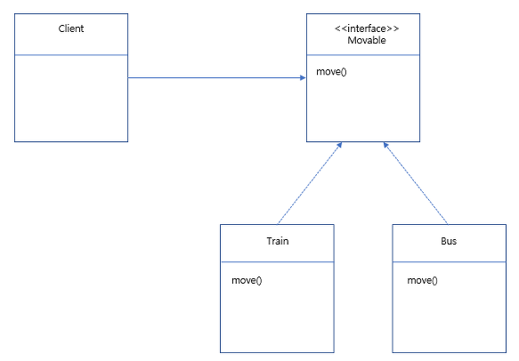

### 2023-06-17
<details>
<summary>P.12 ~ P.46 Chapter 1 ~2 </summary>

고객 : "처음에는 요구 사항을 빠르게 반영해주었는데 시간이 지날수록 간단한 요구 사항도 개발이 안되고 있다."

개발자 : "단순해 보여도 변경할 곳이 너무 많다. 어떤 기능에 문제가 생길지 모른다."

소프트웨어의 설계가 미숙하고 엉망일 때 발생하는 전형적인 증상이다.

---

**if-else문을 추가할 수록 코드는 지저분해진다.**

요구사항이 추가될 수록 단순히 복사-붙여넣기로 추가하면 되므로, 빠르게 구현할 수 있다.

그러나 코드가 커지다 보면 추가하거나 수정하기 어려워지고 오래걸리게 된다.

이것이 "초기 요구사항은 빠르게 개발되었는데 시간이 갈 수록 개발이 안된다." 상황이다.

---

**수정하기 좋은 코드를 가져야 한다.**

- 코드를 분리하자. 두 종류의 코드가 섞일 때보다 분리할 때 더 구분하기 쉽다.

- 하나의 애플리케이션에 여러개의 기능이 분산된 것보다는 구조를 복잡하게 잡고, 코드를 분리함으로써 코드가 간결해지는 것이 낫다.

- 추가사항이 발생하면 기존의 처리 코드가 영향을 받지 않는다.

객체지향 설계를 통해 소프트웨어를 쉽게 변경할 수 있는 유연함을 가져야 한다.

---

**절차지향**은 프로그램 규모가 커질수록 데이터 타입이 변경되거나, 다른 예기치 못한 값을 추가 해야 할 경우 프로시저를 모두 수정해야 하거나 오류를 발생하기도 한다.

프로그램 수정 -> 다른 곳 문제 발생 후 수정 -> 다시 다른 곳 문제 발생 후 수정의 악순환 발생 가능

**객체지향**은 프로시저를 하나의 객체로 묶어 각 객체는 자신만의 기능만 제공하게 한다.
객체 별로 데이터와 프로시저를 알맞게 설정해야 한다. 이를 통해 객체의 데이터를 변경하더라도
해당 객체만 수정하면 된다. 이는 "캡슐화" 장점을 갖는다.

---

객체는 어떤 데이터 타입 값으로 보관하는지 중요하지 않다.

객체는 그 행위가 어떻게 일어나는지 알 수 없다. 단지, 그 행위 기능을 제공한다는 것이 중요한다.

이를 인터페이스(객체가 제공하는 기능에 대한 명세서)와 클래스를 사용하여 제공한다.

```
이 인터페이스를 이용하여 클래스를 구현하고 클래스는 메모리에 객체(인스턴스) 생성
이 인스턴스는 인터페이스에 정의된 기능 제공
```

---

객체는 자신만의 책임과 크기가 있다.

파일 읽기, 암호화 처리, 파일 쓰기 객체들은 각각 자신의 기능만 수행하고 책임을 가져야 하며 다른 기능이 필요할 경우 해당 객체에 요청한다.

객체 지향 설계를 지닌 프로그램을 만들기 위해 객체에 대한 할당을 미리 결정해야 한다.

- 기왕이면 객체가 갖는 책임을 작게하고 객체가 제공하는 기능의 갯수가 적도록 구현한다.

- 여러개의 프로시저를 하나의 기능에 넣지말고(절차지향이 되버린다.) 한 객체는 하나의 책임을 갖게 함으로써, 객체가 갖는 책임을 분해한다. 이를 단일 책임 원칙(Single Responsibility Principle; SRP)이라고 한다.

---

**한 객체가 다른 객체의 메서드를 호출할 때 의존(Dependency)라고 한다.**

- 의존을 할 경우 해당 객체의 타입이 변경될 때 나도 변경될 가능성이 높다.

- 순환 의존이 발생할 수 있다. A -> B -> C -> A 순서대로 호출할 수 있기 때문이다.

- 이를 해결하기 위해 의존 역전 법칙(Dependency inversion principle; DIP)를 적용한다.

</details>

<br>

### 2023-06-22
<details>
<summary>P.43 ~ P.77 Chapter 2 ~ 3 </summary>

```
**의존의 양면성**
요구사항이 추가되어 boolean 값 리턴이 아닌 String을 리턴해야 할 때가 생길 수 있다.
- 내가 변경되면 나에게 의존하고 있는 코드에 영향을 준다.
- 나의 요구가 변경되면 내가 의존하고 있는 타입에 영향을 준다.

**캡슐화**
객체 지향은 캡슐화를 통해 다른 곳에 미치는 영향을 최소화 해야 한다.

캡슐화란 객체가 내부적으로 어떻게 기능을 구현하는지 감추는 것.
이를 통해 내부의 기능 구현이 변경되더라도 기능을 사용하는 코드는 영향을 받지 않게 한다.

절차 지향으로 프로그래밍할 경우 변경사항이 생겼을 때, 예:) A기능을 AA로 바꾸어 주세요
하였을 때, A를 사용하는 모든 로직을 연쇄적으로 변경해야 한다.

예:) if(member.isMale() && member.getExpiryDate()!= null && //조건 생략) {
    // 만료에 따른 처리
}


캡슐화된 기능을 통해 다음과 같은 이점을 얻는다. 
1. A 기능을 메서드화 한다.
2. A 기능을 AA로 바꾸어 주세요.
3. 메서드화된 A기능 로직을 바꾼다.
4. 해당 기능을 사용하는 모든 로직들은 변경사항이 일어나지 않는다.

예:) if(member.isExpired()){
    // 만료에 따른 처리
}

해당 로직은 isExpired() 메서드가 어떻게 구현했는지 모른다. 단지 isExpired가 만료되면 만료 처리를 할 뿐이다.

캡슐화를 위해 두 규칙을 지키자
- Tell, Don't Ask (데이터를 물어보지 말고 기능을 실행해라)
- 데미테르의 법칙
    (메서드에서 생성한,
     파라미터로 받은,
     필드로 참조하는)
위의 3가지 에 대한 객체의 메서드만 호출한다.

member.getDate().getTime()과 같이 getDate()메서드가 리턴한 getTime() 메서드를 호출하면 데미테르의 법칙 위반이다.
-> member.someMethod() 와 같이 구현하자.

"신문 배달부와 지갑 문제"가 이에 대한 문제를 정확히 지적한다.

---

객체지향 설계 과정은 다음과 같다.

1. 제공해야 할 기능을 찾고, 세분화하고 알맞은 객체에 할당한다.
    A. 기능을 구현할 때 필요한 데이터를 객체에 추가한다.
    B. 그 데이터를 이용하는 기능을 넣을 수 있다.
    C. 기능은 최대한 캡슐화 한다.
2. 객체 간에 어떻게 메시지를 주고받을지 결정한다.
3. 위 과정을 반복한다.

객체의 크기는 구현을 진행하는 과정에서 점진적으로 명확해진다. 개발이 진행되며 설계도 변경되기 때문이다. 그렇기에 유연한 구조를 갖도록 해야 한다.
그렇기에 구현 과정에서 한 클래스의 책임이 섞여 있다면 객체를 새로 만들어 책임을 분리시킨다.

암호화 객체 -> 파일 읽기 , 파일 쓰기
위 방법에서
흐름 제어 객체 -> 파일 읽기, 암호화, 파일 쓰기

---
**다형성과 추상화**
Coupon 클래스가 쿠폰의 기본적인 기능을 제공하고 있을 때,
새로운 쿠폰 기능을 구현할 때는 Coupon 클래스를 상속받아 사용한다.

상속받는 자식(하위) 클래스와 상속해주는 상위(부모) 클래스라고 부른다.
부모가 구현한 클래스를 구현받을 수 있는 것이다.

그러나 모든 기능을 다 주면 안될 때가 있다. 이를 접근 지정자(private, public 등)를 통해 제한한다.

부모 기능을 재정의 해서 사용할 경우, @Override 사용
---
다형성은 한 객체가 여러 가지 모습을 갖는다는 것을 의미 한다. 상속을 통해 구현한다.

한 객체가 타입A, 타입B, 타입C의 기능 실행 요청을 처리할 수 있음으로써 각 타입마다 다르게 사용할 수 있다.

상속에는 인터페이스 상속(메서드 직접구현)과 구현 상속(구현된 메서드 수정 가능)이 있다.
---
**추상화와 유연함**

A,B,C의 서로 다른 기능이 있다. 그런데 3 기능은 '로그 수집'이라는 프로세스를 처리하는 과정이다.
이 기능들을 추상화 함으로써 '로그 수집'이라는 개념으로 정의한다.

interface LogCollector{
    public void collect();
}
다음과 같은 인터페이스는 시그니처만 정의할 뿐 실제 구현을 제공하지 못한다.
이 추상타입은 A,B,C중 어떤 기능을 할지 모르고 '로그 수집'이라는 의미만 제공한다.

왜 추상화를 사용하는가?
데이터 변경사항이 일어날 때마다 다른 객체가 본연의 책임과 상관없는 일을 하지 않게 하기 위해서이다.

추상타입의 다형성을 통해 하나의 타입으로 동작시킬 수 있다.
이를 통해 이를 사용하는 객체는 그 타입만 사용하도록 수정할 수 있다.
예:)FileDataReader, SocketDataReader가 ByteSource 타입을 상속받으면,
    FlowController는 ByteSource만 사용하면 된다.

ByteSource 타입의 객체를 생성하는 기능을 별도 객체로 분리한 뒤, 그 객체를 사용해서 ByteSource 생성, DI를 통해 ByteSource를 전달받으면, 캡슐화까지 가능!

이를 통해 ByteSource에 추가 구현 클래스가 생성되거나, 종류가 변경되어도 FlowController 클래스는 변경이 없으며, FlowController의 제어 흐름을 변경할 때, ByteSource의 객체 생성 부분은 영향을 주지 않는 유연함을 갖을 수 있게 된다.
```
</details>

<br>


### 2023-06-23
<details>
<summary>P.78 ~ P.102 Chapter 3 ~ 4 </summary>

```
변경되는 부분은 추상화 해야 한다.
다양한 상황에서 코드를 작성하고 유연한 설계를 만들어 보는 경험이 필요하다.

요구사항이 변경될 때, 변화되는 부분들을 추상 타입으로 교체하면 유연하게 대처가 가능하다.

인터페이스에 대고 프로그래밍을 하면 유연함을 얻을 수 있다.
그러나, 타입이 증가하고 구조도 복잡해지기 때문에 변화 가능성이 높은 경우에만 사용한다.

인터페이스는 사용하는 코드 입장에서 알아볼 수 있도록 명확하게 작성해야 한다.

다른 사람이 일시적으로 테스트가 필요하지만 구현이 완성되지 않았을 때, 인터페이스를 통해 Mock객체를 만들어 하드코딩 한 뒤, 테스트 할 수 있도록 돕는 장점이 있다.

---
**상속보단 조립**
상속을 통한 단점은 다음과 같다.
1. 상위 클래스 변경의 어려움
    - 계층도가 커질수록 영향을 받는 클래스가 많아 상위 클래스 변경이 어렵다.

2. 불필요한 클래스 증가
    - 비슷한 클래스가 있음에도 불구하고 지속적인 상속을 통해 불필요하게 증가한다.

3. 상속의 오용
    - 많은 메서드들에 대해 어떤 것을 사용할지 몰라 비정상적으로 사용할 가능성이 있다.

---
조립을 통해 재사용이 가능하다.

클래스를 재사용함으로써 조립을 한다.
Class Storage {
    Compressor compressor();
    Encryptor encryptor();
    boolean useCompression();
    boolean useEncrpytion();

    //추가 조립을 통해 재사용 가능
    boolean useCache();
}
Storage 자체에서 압축,캐시 등의 목적으로 사용할 수 있도록 제공이 가능하다.
또한 조립은 런타임에 객체를 바꿀 수 있다.

그렇기 때문에 기능을 재사용해야 할 경우 상속보다는 조립을 고민하자.

---
위임(delegation)을 통해 내가 할 일을 다른 객체에 넘긴다. 조립 방식을 통해 구현한다.
이를 통해 세분화 되는게 많아지지만 이 과정에서 조립과 위임을 통해 객체를 재사용할 수 있다.

상속은 명확한 IS-A('A는 B이다') 관계가 성립될 때만 사용하자.
```
</details>

<br>

### 2023-06-25
<details>
<summary>P.104 ~ P.136 Chapter 5 </summary>

```
**설계원칙 SOLID**

객체지향적 기본의 설계 원칙은 다음과 같다.

- 단일 책임 원칙(Single responsibility principle; SRP)
    - 클래스는 단 한 개의 책임을 가져야 한다.
    - 여러 책임을 갖게 되면 그 클래스의 각 책임과 관련 코드가 변경될 수 있다.
    - 하나의 클래스가 가진 서로 다른 메서드를 사용할 때, 그 메서드가 요구하는 타입으로 변경 되어야 할 경우
    각각 다른 책임에속할 가능성이 높고 책임 분리 후보가 될 수 있다.

- 개방 폐쇄 원칙(Open-close principle; OCP)
    - 확장에는 열려 있어야 하고, 변경에는 닫혀 있어야 한다.
        - 기능을 변경, 확장하면서 그 기능을 사용하는 코드는 수정하지 않는다.
    - 추상화, 상속, 오버라이딩을 통해 구현할 수 있다. 이를 통해 클래스 코드를 바뀌지 않으면서 확장할 수 있다.
    - 다운 캐스팅은 OCP 원칙을 어기는 증상이다.(insanceof 등의 사용)

- 리스코프 치환 원칙(Liskov Subsitution Principle; LSP)
    - 상위 타입의 객체를 하위 타입의 객체로 치환해도 상위 타입을 사용하는 프로그램은 정상적으로 동작해야 한다.
    - 직사각형 정사각형 문제를 통해 상속 관계 처럼 보여도, 상속 관계로 묶을 수 없다. 이를 별개의 타입으로 구현해야 한다.
    - instanceOf를 연산자를 사용하면 하위 타입이 상위 타입을 대체하지 못하는 상황이 발생하므로 원칙 위반이다.(상위 타입의 추상화가 덜 된 것이다.)

- 인터페이스 분리 법칙(Interface Segregation Principle; ISP)
    - 인터페이스는 그 인터페이스를 사용하는 클라이언트 기준으로 분리해야 한다.
        (자신이 사용하는 메서드에만 의존해야 한다.)
    - 사용하는 기능만 제공하도록 인터페이스를 분리함으로써 변경의 여파를 최소화 한다.
        (단일 책임 원책과도 연결된다.)
    - 인터페이스 중심으로 분리하면 클라이언트가 영향을 받을 수 있으므로 분리하는 기준을 클라이언트로 한다.

- 의존 역전 법칙(Dependency Inversion Principle; DIP)
    - 고수준 모듈(상대적으로 큰 틀)은 저수준 모듈(개별적인 요소가 어떻게 구현)의 구현에 의존하면 안된다.
        저수준 모듈이 고수준 모듈에서 정의한 추상 타입에 의존해야 한다.
    - 고수준 모듈의 추상화를 통해 유연함을 확보한다.
        이를 통해, LSP, OCP 설계를 만들어준다.
    - 기능상 필요없는 고수준 모듈을 저수준 모듈로 사용할 경우 독립적인 배포가 어렵다.

이들을 합쳐 SOLID 설계 원칙이라고 한다.

```

</details>

### 2023-06-26
<details>
<summary>P.137 ~ P.154 Chapter 6 DI_1 </summary>

```
**DI(Dependency Injection; 의존성 주입)**

변화되는 부분을 추상화한 인터페이스는 패키지의 다른 코드에 영향을 주지 않으며 
확장할 수 있는 구조를 갖고 있다.(개방 폐쇄 원칙)

인터페이스를 상속받아 구현한 클래스는 구상 클래스
(new 키워드를 사용하여 인스턴스를 만드는 클래스)에 의존하지 않는다.(의존 역전 원칙)

각각의 클래스가 서로의 타입에 의존할 경우 순환 의존을 발생시킨다. 
향후 유지보수를 위해선 발생시키지 말아야 한다.

추상화한 객체를 사용하게 되면 생성과 초기화를 해주는 것은 누구인가?

이를 메인이 수행한다.
    - 어플리케이션 영역에서 사용될 객체 생성
    - 각 객체 간의 의존 관계 설정
    - 어플리케이션 실행

모든 의존은 메인 영역에서 어플리케이션 영역으로 향한다. 반대는 존재하지 않으며 변경되지도 않는다. 

필요한 객체를 가져와 기능을 실행시켜 객체를 제공하는 책임을 갖는 객체를 Service Locator 라고 한다. 
그러나 Service Locator를 보완하기 위한 방법으로 DI를 사용하자.

--------------

DI는 외부에서 의존(dependency)하는 객체를 주입(injection) 하는 방법이다.

main 메서드에서 생성자를 통해 이들이 사용할 객체(인스턴스에 생성된 객체)를 주입(Injection) 한다.

main 클래스는 다른 객체에게 객체 생성과 조립 책임을 위임한 뒤 그 객체가 생성한 객체를 구하는 방식으로 변경된다.

객체 조립 기능이 분리됨으로써, XML 파일을 이용하여 이를 설정하고 파일을 읽어와 초기화 해줄 수 있도록 할 수 있다.
스프링 프레임워크가 이를 제공해준다.

--------------
2.1 생성자 방식
생성자를 통해 의존 객체를 전달받는 방식이다.
private JobQueue jobQueue;

//생성자를 통해 객체를 필드에 보관한 뒤 의존 객체 전달 받음
public JobCLI(JobQueue jobQueue){
    this.jobQueue = jobQueue;
}

생성자 방식은 객체를 새엇ㅇ하는 시점에 필요한 모든 의존 객체를 준비할 수 있기 때문에 생성하는 시점에서 의존 객체가 정상인지 알 수 있다.

설정 메서드 방식은 객체를 생성한 뒤에 의존 객체를 주입함으로써, 설정하지 못한 상태에서 객체를 사용하기 때문에 NPE가 발생하기도 한다.

DI는 의존 객체를 Mock 객체로 쉽게 대체할 수 있어서 단위 테스트 하기 쉽다.

```

</details>


### 2023-06-27
<details>
<summary>P.154 ~ P.172 Chapter 6 DI_2 </summary>

```
기존에는 XML을 이용하여 DI를 하였으나 스프링 3버전 이후 자바 코드 기반으로 설정을 할 수 있게 되었다.

안드로이드 프레임워크는 DI 처리가 어려워 Service Locator를 사용한다.

Service Locator는 어플리케이션에서 필요로 하는 객체를 제공하는 책임을 갖는다.
그렇기에 Service Locator에 의해 객체를 구하고 기능을 실행하면 이에 맞는 리턴을 할 수 있어야 한다.

메인 영역에서 Service Locator터가 제공할 객체를 생성하고
어플리케이션 영역에서 Service Locator를 초기화 한다.

----

1.객체 등록 방식의 Service Locator 구현 방법

Service Locator를 사용할 때 사용할 객체 전달
인스턴스를 지정하고 참조하기 위한 static 메서드 제공

위 두 방식을 통해 생성자 방식으로 생성 후 static 메서드를 만들어 접근할 수 있도록 만든다.

객체가 많을 경우 가독성이 떨어지므로 별도로 제공해준다.

2.상속을 통한 Service Locator 구현 방법

객체를 구하는 추상 메서드를 제공하는 상위 타입 구현
상속 타입을 상속받은 하위 타입에서 사용할 객체 설정

두 방식을 통해 추상 메서드 구현 + 해당 메서드를 구현한 객체 방식으로 만든다.

3. Generic/Template를 이용한 Service Locator 구현 방법

중복해서 만드는 문제를 피하기 위해 Generic을 사용한다.
의존 대상들의 타입이 명시되지 않기 때문에 타입이 변경 되어도 영향을 받지 않는다.

Service Locator의 단점은 인터페이스 분리 법칙을 위반하고 다른 타입에 대한 의존이 발생한다.
뿐만 아니라, 동일 타입 객체가 다수 필요할 경우 별도로 메서드를 만들어 주어야 한다.

이 문제들은 변경의 유연함을 떨어트리고 DI에서 발생하지 않기 때문에 DI를 사용하자.
```

</details>

<br>

### 2023-07-03
<details>
<summary>P.174 ~ P.188 Chapter 7 디자인 패턴 </summary>

### 디자인 패턴이란?

- 재설계를 최소화 하며 요구 사항의 변화를 수용할 수 있도록 반복적으로 사용되는 설계, 클래스, 구성, 객체간 흐름 등에 대해 발생하는 일정한 패턴

디자인 패턴 장점

- 각 패턴의 장단점을 통해 올바른 설계 빠른 적용 가능
- 시스템의 문서화, 이해, 유지 보수 도움

#### 전략(Strategy) 패턴

if - else문으로 코드를 구현하면 기능이 추가될 때마다 메서드를 수정해야 한다.
또한 코드 분석을 어렵게 만든다.

이를 해결하기 위해 가격 할인 정책을 별도 객체로 분리한다.

예시:)



Client - 콘텍스트
Interface - 전략
Train, Bus - 전략 콘크리트 클래스

상품의 할인 금액 계산을 추상화 하고 이를 구현한 클래스는 이에 맞는 계산 알고리즘을 제공한다.

이렇듯 기능(전략, 알고리즘)을 별도로 분리하는 설계 방법을 전략 패턴이라고 한다.

이를 통해, 콘크리트 클래스(인터페이스, 클라이언트 쌍을 이룬 것) 코드의 변경 없이 새로운 전략을 추가할 수 있다.

---

#### 템플릿 메서드(Template Method) 패턴

- 완전히 동일한 절차(예: 인증 처리 과정)를 가진 코드를 작성하는 일이 있다.

- 실행/단계는 동일하나 각 단계의 일부의 구현이 다를 경우 사용하는 것이 **템플릿 메서드** 패턴이다. 다음 2가지로 구성된다.

    - 실행 과정을 구현한 상위 클래스

    - 실행 과정의 일부 단계를 구현한 하위 클래스

기능을 구현하는데 필요한 각 단계를 정의할 때, 일부 단계는 추상 메서드를 호출하는 방식으로 구현한다.

-> 두 Method에서 동일했던 실행 과정을 구현할 경우, 추상 메서드로 분리한다.
-> 이 메서드를 상속받아 하위 클래스에서 알맞게 재정의 해준다.

비슷한 코드가 중복될 때, 템플릿 메서드를 사용하기 좋다.

일반적인 경우, 하위 타입이 상위 타입의 기능을 재사용하나
템플릿 메서드 패턴에서는 상위 타입이 실행 흐름을 제어하고 하위 타입은 이를 호출하는 구조를 갖는다.

</details>